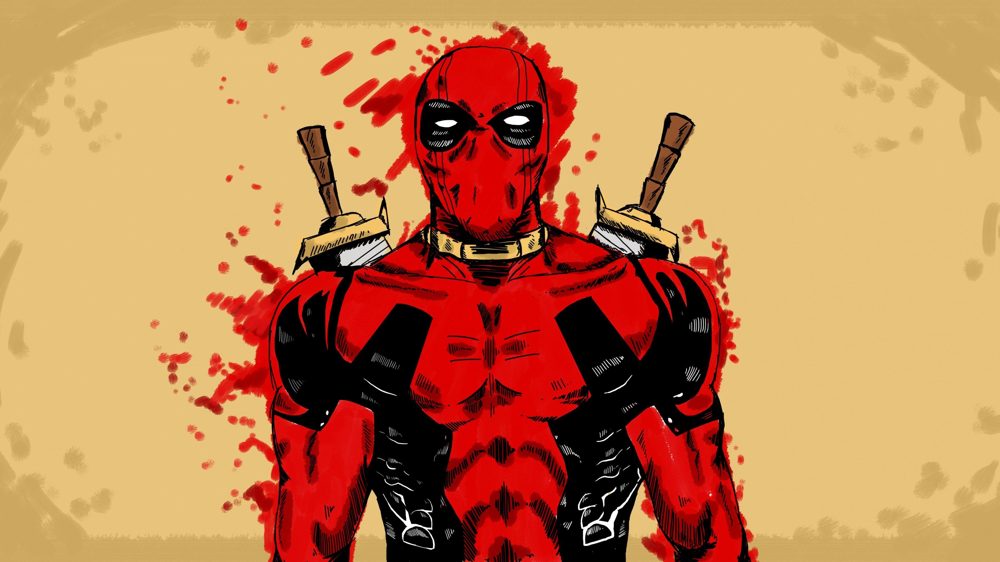

# DeadpoolOS — mywebOS

> A Deadpool themed web OS

Made for **Stardance**.



## Features

**Desktop window manager (vanilla JS)**
  - Draggable windows via header handle
  - Open / close / minimize via dock buttons and `data-open` / `data-close` / `data-minimize` attributes
  - Click to focus
**Live clock**
  - Topbar clock updates every second via `toLocaleTimeString()`
**Deadpool HQ (welcome window)**
  - Hero heading, subtitle, and `deadpool.png` hero image
  - Opened by default; re-open from topbar (`DEADPOOL OS`) or dock `HQ` button
**Wade's Crew window (`#heroes`)**
  - Deadpool facts / character list: Wade, Cable, Domino, Wolverine, Blind Al, Bob
**Merc Jobs Board window (`#missions`)**
  - Chimichanga Run, Annoy Cable, Break the 4th Wall, Pet a unicorn
**Deadpool Quiz (`#quiz`)**
  - 6 questions (real name, favorite food, healing factor, movie actor, suit colors, first appearance in `New Mutants #98`)
  - Progress counter, score tracker, progress bar, per-answer quips, correct/wrong highlighting, Next / Restart flow
  - Result tiers: Perfect / 4+ / 2+ / Trash
**RNG 6-digit Roller (`#rng`)**
  - Slot-machine scramble animation, reels lock one-by-one (`400 + i * 350` ms)
  - Numbers rated based on rarity


## Project structure

```
mywebOS/
├── index.html    # Topbar, desktop windows (welcome/heroes/missions/quiz/rng), dock
├── style.css     # Deadpool theme, windows, quiz, RNG reels, dock, mobile queries
├── script.js     # Clock, window manager, quiz logic, RNG 
├── deadpool.png  # Welcome window picture
├── bg.jpg        # Desktop wallpaper (creds to WallpaperAccess)
└── README.md
```

## Explore this project


Option 1: just go to the github page for this repo at arsenal4eva.github.io/mywebOS/ 

Option 2: localhost:
```bash
git clone github.com/arsenal4eva/mywebOS
cd mywebOS
python3 -m http.server 8000
# then open http://localhost:8000
```

## Usage guide

- **Move windows:** drag by the header bar. Click any window to bring it to front.
- **Open apps:** use dock buttons at bottom: `HQ` / `Quiz` / `RNG` / `Crew` / `Jobs`. Click `DEADPOOL OS` top-left to re-open HQ.
- **Close / minimize:** `✕` closes (hides), `—` minimizes (also hides the window, re-open from dock).
- **Quiz:** pick an answer, read Wade's quip, `Next ➜`. `Restart` resets to Q1, score 0.
- **RNG:** press `SPIN` → reels scramble then lock → CP + badges + quip appear → history logs it. `Copy` copies last roll (`navigator.clipboard`). (Inspired by RNGdle at rngdle.com)
- **Live Clock:** top-right, updates every second.


## Credits
Wallpaper: `bg.jpg` found online, creds to **WallpaperAccess**.
Deadpool character/lore: Marvel. This is a fan parody project.
Built with vanilla HTML/CSS/JS for Stardance.


